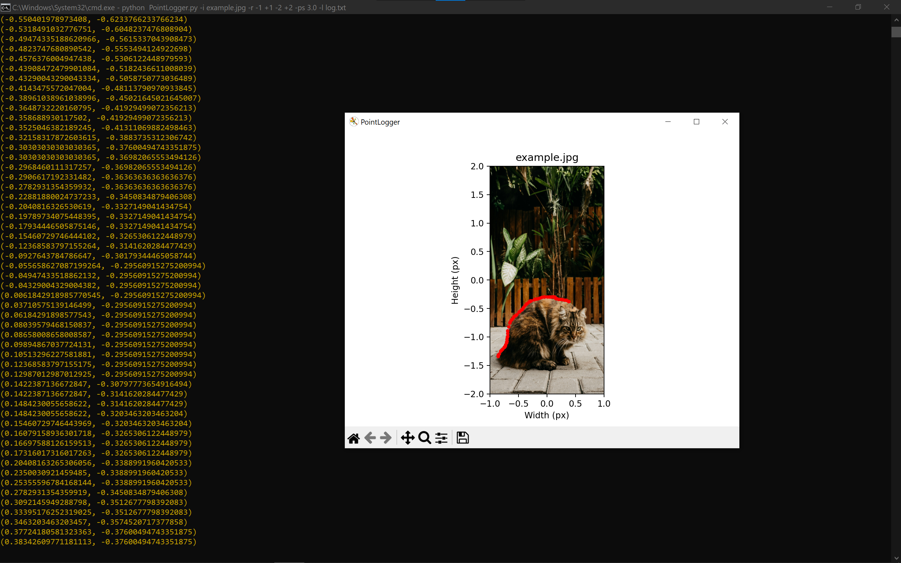

# PointLogger

This Python program extracts pixel locations from an image and provides their coordinates, which can be used to create silhouette effects in graphics programming. The tool is designed as a utility to aid in graphics projects where precise pixel data is required for rendering or other purposes.

## Features

- **Extract Pixel Locations**: Outputs the coordinates of selected pixels from an image.
- **Graphical Interface**: Displays the image with marked points to visualize the extracted pixels.
- **Normalized Coordinates**: Pixel locations are normalized for easier integration into graphics pipelines.
- **Customizable Options**: Configure various parameters such as image range, point size, and output logging.

## Usage

1. Download the repository or clone it using below command.
	```bat
	git clone https://github.com/the-z3ron3/PointLogger
	```
2. Go into PointLogger folder.
	```bat
	cd PointLogger
	```
2. Install the required Python libraries using:
   ```bat
   pip install -r requirements.txt
   ```
3. Run the program:
   ```bat
   python PointLogger.py -i <image_path> [options]
   ```
   Replace `<image_path>` with the path to your input image.
   
   Run ```python main.py -h``` to get more options.

## Arguments

- `-h`, `--help`: Show help message and exit.
- `-i <image>`: Specify the image file to process (required).
- `-r <range>`: Set the coordinate range in the form `(-X +X -Y +Y)`. Default is `-1 +1 -1 +1`.
- `-l <filename>`: Write coordinates to the specified file.
- `-ps <size>`: Set the size of red points drawn on the image. Default is `2.5`.
- `-v`, `--version`: Show the program's version and exit.

## Output

### Command Example

```bat
python PointLogger.py -i example.jpg -r -1 +1 -2 +2 -ps 3.0 -l log.txt
```

This command processes the image `example.jpg` with the coordinate range (-1, +1 -2, +2), sets the point size to `3.0`, and logs the coordinates to `log.txt`.



> **Note:** There is a possibility of missing coordinates if high resolution image is used and mouse is dragged very fast over the image. For such case, move the mouse very slowly to capture every coordinate or use a low resolution image. Try using [images/example_low_res.jpg](images/example_low_res.jpg) as example.

## Applications

- **Graphics Programming**: Helps in creating silhouette effects for 2D or 3D rendering.
- **Image Analysis**: Facilitates the extraction of specific pixel data for processing.
- **Artistic Rendering**: Supports creative rendering projects where pixel-level precision is needed.

## Requirements

- Python >=3.5
- Libraries: `matplotlib`, `numpy`, `Pillow`

---

Thank you for exploring this project! Feedback and suggestions are always appreciated.

